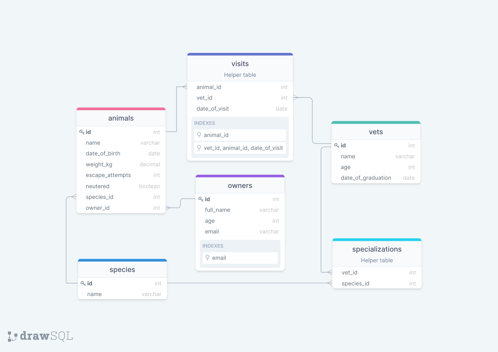

# VET CLINIC

> this project is an introduction to databases where we learn to create tables, insert data on tables and make some basic queries to that information.

## Schema

## Getting Started

This repository includes files with plain SQL that can be used to recreate a database:

- Use [schema.sql](./schema.sql) to create all tables.
- Use [data.sql](./data.sql) to populate tables with sample data.
- Check [queries.sql](./queries.sql) for examples of queries that can be run on a newly created database. **Important note: this file might include queries that make changes in the database (e.g., remove records). Use them responsibly!**

## Authors

👤 **Anja**

- GitHub: [@Anjacodes](https://github.com/Anjacodes)
- Twitter: [@Anja_Schmidt7](https://twitter.com/Anja_Schmidt7)
- LinkedIn: [LinkedIn](https://www.linkedin.com/in/anja-schmidt7/)

👤 **Leonardo**

- GitHub: [@maccrazyman](https://github.com/MacCrazyman)
- Twitter: [@maccrazyman](https://github.com/MacCrazyman)
- LinkedIn: [LinkedIn](https://github.com/MacCrazyman)

## 🤝 Contributing

Contributions, issues, and feature requests are welcome!

Feel free to check the [issues page](../../issues/).

## Show your support

Give a ⭐️ if you like this project!

## Acknowledgments

- Hat tip to anyone whose code was used
- Inspiration
- etc

## 📝 License

This project is [MIT](./MIT.md) licensed.
